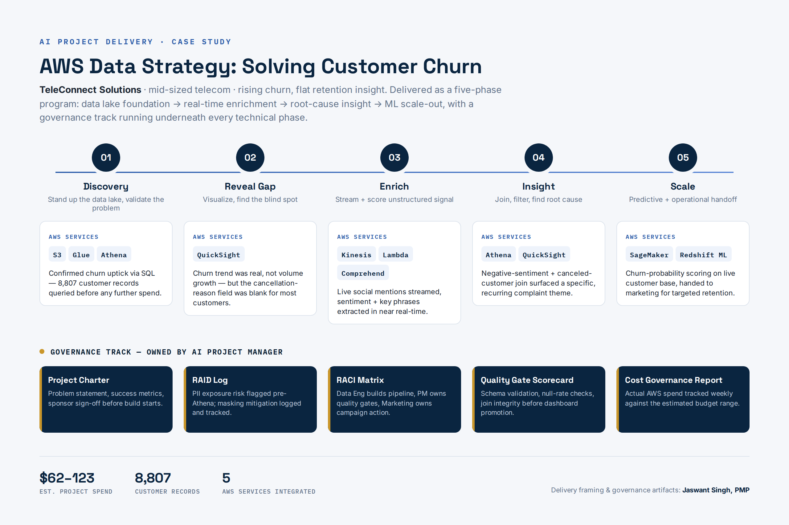
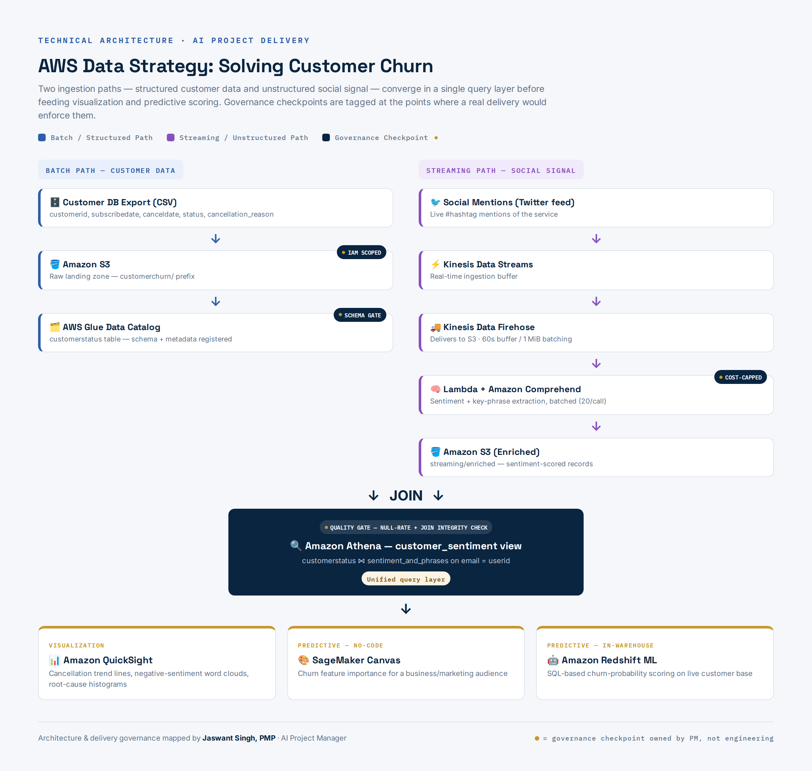

# AWS Data Strategy: Solving Customer Churn with Data & AI/ML Services

**A five-phase data pipeline that finds the *real* reason customers cancel — when the structured survey data doesn't say why.**

Built on AWS (S3, Glue, Athena, Kinesis, Lambda, Comprehend, QuickSight, SageMaker, Redshift ML), delivered with an AI Project Manager's governance lens: charter, RAID log, RACI, quality gates, and cost tracking alongside the technical build.



---

## 📌 Project Summary

| | |
|---|---|
| **Scenario** | Mid-sized telecom (TeleConnect Solutions) facing rising customer churn with no clear signal on root cause |
| **Core problem** | The structured `cancellation_reason` field is blank for most canceled customers — the "why" isn't in the obvious dataset |
| **Approach** | Stand up a batch data lake to confirm the trend, then stream + enrich unstructured social sentiment to find the signal the structured data is missing |
| **Stack** | S3 · Glue · Athena · Kinesis Data Streams · Kinesis Firehose · Lambda · Amazon Comprehend · QuickSight · SageMaker Canvas · Redshift ML |
| **Est. cost** | $62–123 (AWS Free Tier eligible for Phases 1–2) |
| **Role** | AI Project Manager — delivery governance, quality gates, cost tracking, stakeholder-facing insight |

---

## 🏗️ Architecture



Two ingestion paths converge at a single query layer:

- **Batch path** — structured customer data (`customerid`, `subscribedate`, `canceldate`, `status`, `cancellation_reason`) lands in S3, gets cataloged in Glue, and is queried via Athena.
- **Streaming path** — live social mentions are captured via Kinesis Data Streams → Firehose → S3, then enriched with sentiment and key-phrase extraction via Lambda + Amazon Comprehend.
- **Join** — Athena joins the two on `email = userid`, producing a unified `customer_sentiment` view.
- **Output** — QuickSight for visualization; SageMaker Canvas and Redshift ML for churn-probability scoring.

---

## 📂 Repo Structure

```
.
├── README.md
├── LICENSE
├── architecture/
│   ├── 01-delivery-phases-and-governance.png
│   └── 02-technical-architecture.png
├── governance/
│   └── README.md            # links/points to the governance tracker (Charter, RAID, RACI, Quality Gate)
├── lambda/
│   └── README.md            # placeholder for the sentiment/key-phrase enrichment function
└── screenshots/
    └── README.md            # checklist of screenshots to add once the lab is run end-to-end
```

---

## 🧭 Delivery Phases

### Phase 1 — Discovery
Data lake foundation on S3 + Glue Data Catalog + Athena. Validate the churn trend with SQL before committing further budget.

### Phase 2 — Reveal Gap
QuickSight confirms the churn trend is real, not just customer volume growth — but the cancellation-reason field is a dead end. This is the go/no-go point for investing in streaming enrichment.

### Phase 3 — Build
Kinesis Data Streams + Firehose capture live social mentions. Lambda + Comprehend score sentiment and extract key phrases in near real-time.

### Phase 4 — Insight
Join enriched sentiment data back to the customer table in Athena, filtered to negative-sentiment + canceled customers. This is where the root cause surfaces.

### Phase 5 — Scale
Handoff to SageMaker Canvas (no-code churn feature importance for business stakeholders) and Redshift ML (SQL-based churn-probability scoring on the live customer base).

---

## 🛡️ Governance Artifacts

As the AI Project Manager on this delivery, the technical build was paired with:

- **Project Charter** — problem statement, success metrics, sponsor sign-off
- **RAID Log** — e.g. PII exposure risk in the raw customer export, mitigated via IAM least-privilege and field-level masking before Athena exposure
- **RACI Matrix** — Data Engineering owns pipeline build; PM owns quality gates and stakeholder comms; Marketing owns retention-campaign action on the output
- **Quality Gate Scorecard** — schema validation, null-rate checks, join integrity before promoting Athena views to QuickSight dashboards
- **Cost Governance Report** — actual AWS spend tracked against the $62–123 estimate, with resource cleanup confirmed at project close

See [`governance/`](governance/) for the tracker.

---

## 💰 Cost Governance

This project is designed to be run and torn down cleanly:
- Phases 1–2 (S3, Glue, Athena, QuickSight) are Free Tier eligible for light usage.
- Phases 3–5 (Kinesis, Lambda, Comprehend, SageMaker) bring the estimated total to $62–123 depending on data volume and QuickSight seat cost.
- All resources are deleted at project close (Kinesis streams, Firehose delivery streams, S3 test data, QuickSight datasets) and the cleanup is logged as part of the cost governance report — not just the build.

---

## 📸 Screenshots

Screenshots from the live run are being added incrementally — see [`screenshots/README.md`](screenshots/README.md) for the full checklist of what's captured and what's pending.

---

## 🙋 About

Delivered and documented by **Jaswant Singh, PMP®** — Calgary-based Project Manager transitioning into AI Project Manager / AI Implementation PM roles, with hands-on AWS and Azure AI/ML delivery experience.

- GitHub: [github.com/JaswantOnGit](https://github.com/JaswantOnGit)

---

## 📄 License

This project is licensed under the MIT License — see [LICENSE](LICENSE) for details.
